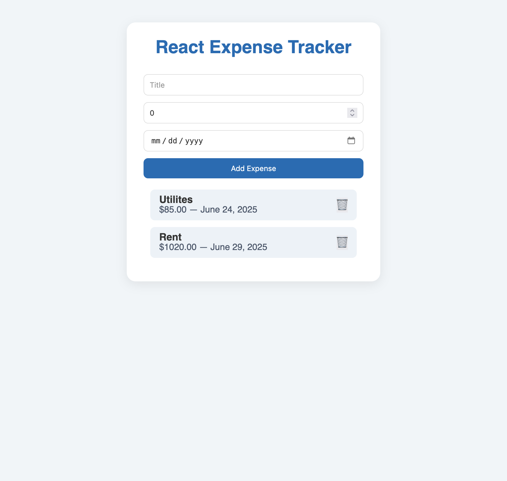

# React + TypeScript + Vite

# Basic React Expense Tracker

## Overview: 
- Learn the best way to manage state in React – no unnecessary complexity.
- Master form handling like a pro – fast and effective.
- Discover how to structure components for real-world projects – clean and scalable.

## What You'll Build:
- Dynamic Expense Tracker with Add, Delete, and Display features.
- Clean, modern UI 

### Screenshot

### Links

- Solution URL: [https://github.com/andrewteece/react-expense-tracker](https://github.com/andrewteece/react-expense-tracker)
- Live Site URL: [https://amazing-phoenix-1c849f.netlify.app/](https://amazing-phoenix-1c849f.netlify.app/)

## Author

- Website - [https://andrewteece.com](https://andrewteece.com)